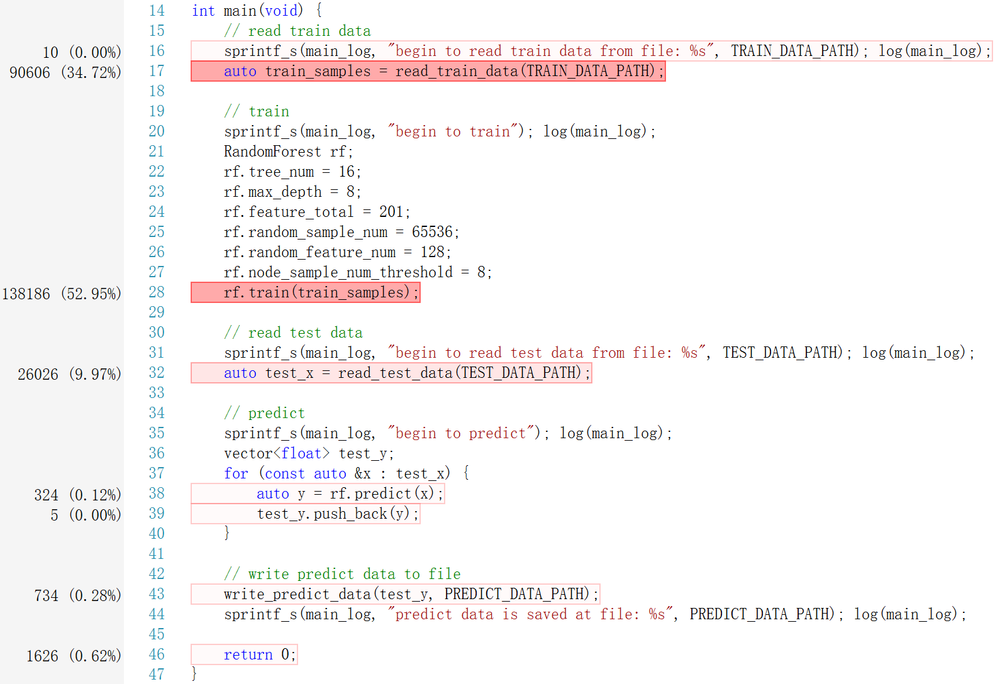
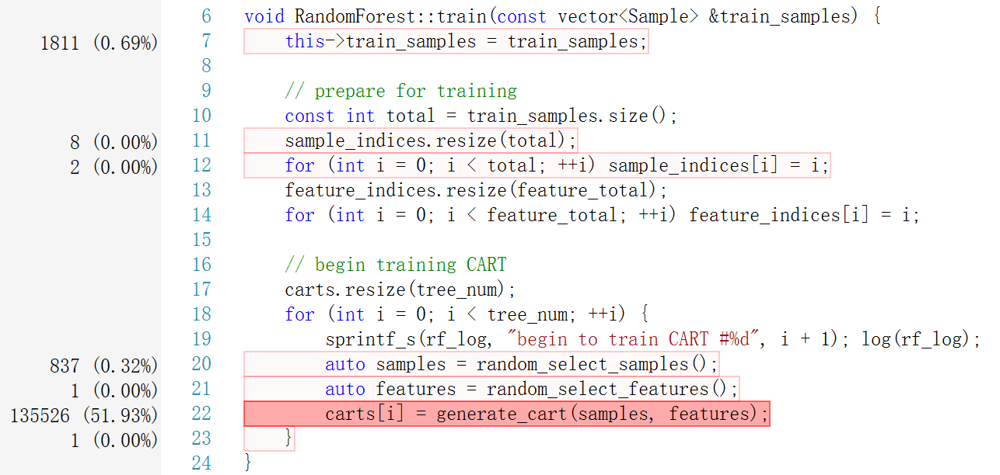
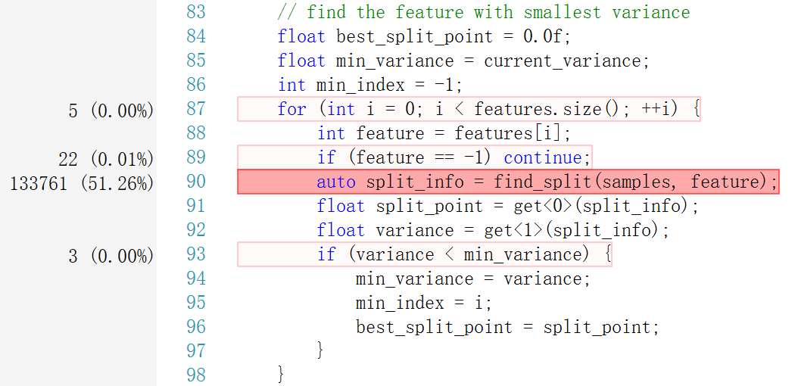
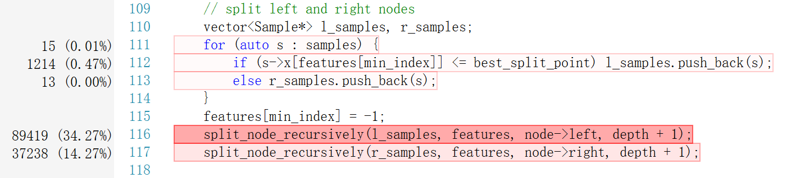
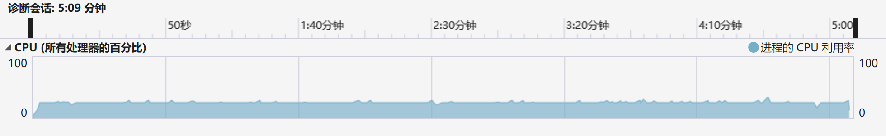
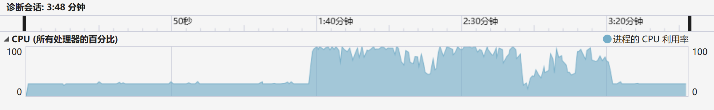
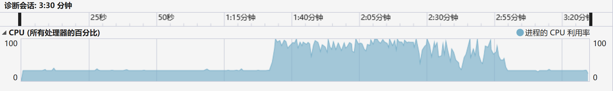
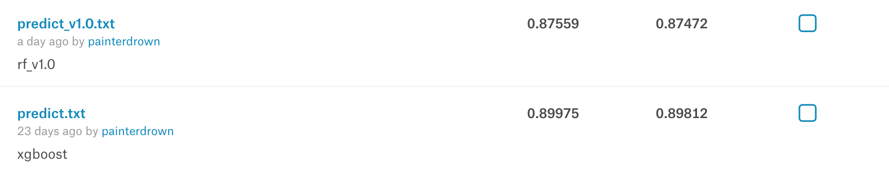

# 随机森林实现与优化报告

> 郑钊  15331424  计算机应用<br/>
> 2018-07-15

[TOC]

## 1. 实验简介

### 1.1. 开发环境

+ Intel(R) Core(TM) i7-5557U
+ 8.00 GB RAM
+ Windows 10 Pro
+ Visual Studio 2017

### 1.2. 运行程序

1. 使用 VS2017 打开 `random-forest.sln`。

2. 修改 `main.cpp` 中下列三者为相应的路径。
  + `TRAIN_DATA_PATH`：训练数据文件的路径
  + `TEST_DATA_PATH`：测试数据文件的路径
  + `PREDICT_DATA_PATH`：测试结果文件的路径

3. 设置 `main.cpp` 中的训练参数。
  + `tree_num`：CART 总数
  + `max_depth`：CART 最大深度
  + `feature_total`：特征总数
  + `random_sample_num`：每次随机抽取样本的数目
  + `random_feature_num`：每次随机抽取特征的数目
  + `node_sample_num_threshold`：CART 节点样本数目的最小值

推荐的参数为：

```C++
rf.tree_num = 16;
rf.max_depth = 8;
rf.feature_total = 201;
rf.random_sample_num = 65536;
rf.random_feature_num = 128;
rf.node_sample_num_threshold = 8;
```

4. `菜单栏` -> `调试` -> `开始执行(不调试)`。

5. 最终输出的预测结果文件在 `PREDICT_DATA_PATH` 对应的路径

## 2. 实现

### 2.1. 随机森林原理

**随机森林**是一种典型的树集成算法，是基于不同的样本、不同的特征训练出 N 颗 CART。本次实验项目虽然是一个二分类的问题，但是由于 Kaggle 上要求的是预测测试样本为正的概率，所以我们这次实验要构造的 CART 不是分类树，而是回归树。随机森林对 N 颗 CART 的回归结果取均值作为最终的预测概率。

**CART**（分类回归树）是一种二分决策树（既能是分类树，又能是分类树）。其在构建的过程中，每次对特征进行切分后只会产生两个子节点，CART 分裂时：

+ 如果 CART 是分类树，采用 GINI 值作为节点分裂的依据；
+ 如果 CART 是回归树，采用样本的最小方差作为节点分裂的依据。

上面已经说了，我们要构造的是 CART 回归树，所以在分裂节点的时候参考的依据是样本的**最小方差**。

### 2.2. 训练算法

1. 随机抽取 n 个样本
2. 随机抽取 k 个特征
3. 基于 1, 2 抽取的样本、特征，训练出一颗 CART

  1. 对于 k 个特征，找出每个特征的最佳分裂点以及对应分裂后的样本均方差
  2. 选择分裂后样本均方差最小的特征进行分裂
  3. 重复 1, 2 直到：

    + 节点的深度达到预设的最大深度 `max_depth`
    + 节点中的样本数目小于预设的阈值 `node_sample_num_threshold`
    + 分裂后的样本均方差大于或等于分裂前的样本方差（没必要再分裂）

4. 重复 1, 2, 3 直到训练出预设数量的 CART 集合

### 2.3. 代码设计

> 基于数据结构 `X`, `Y`, `Sample` 和 `Node`，在 `RandomForest` 中构造 `CART` 集合。

#### 2.3.1. 数据结构

```C++
typedef vector<float> X;
```

```C++
typedef bool Y;
```

```C++
typedef struct {
  X x;
  Y y;
} Sample;
```

```C++
struct Node {
  int feature;
  float value;
  float split_point;
  Node *left;
  Node *right;

  Node() {
    feature = -1;
    value = false;
    split_point = 0.0f;
    left = NULL;
    right = NULL;
  }

  bool is_leaf() const {
    return left == NULL && right == NULL;
  }
};
```

#### 2.3.2. CART

```C++
struct CART {
  Node *root;

  // constructor
  CART() {
    root = NULL;
  }

  // classify
  float classify(const X &x) const {
    Node *node = root;
    while (!node->is_leaf()) {  // while not a leaf node
      if (node->left == NULL) node = node->right;
      else if (node->right == NULL) node = node->left;
      else node = x[node->feature] <= node->split_point ? node->left : node->right;
    }
    return node->value;
  }
};
```

#### 2.3.3. RandomForest

```C++
class RandomForest {

public:
  // params
  int tree_num;                          // CART 总数
  int max_depth;                         // CART 最大深度
  int feature_total;                     // 特征总数
  int random_sample_num;                 // 每次随机抽取样本的数目
  int random_feature_num;                // 每次随机抽取特征的数目
  int node_sample_num_threshold;         // CART 节点样本数目的最小值

  // public methods
  void train                             // 训练
    (const vector<Sample> &train_samples);
  float predict                          // 预测
    (const X &x);

private:
  // train data
  vector<Sample> train_samples;          // 训练样本
  vector<int> sample_indices;            // 训练样本索引（用于随机抽取样本）
  vector<int> feature_indices;           // 特征索引（用于随机抽取特征）
	
  // models
  vector<CART> carts;                    // CART 集合

  // private methods
  vector<Sample*> random_select_samples  // 随机抽取 random_sample_num 个样本
    (void);
  vector<int> random_select_features     // 随机抽取 random_feature_num 个特征（0~200）
    (void);
  CART generate_cart                     // 训练一颗 CART
    (vector<Sample*> &samples, vector<int> &features);
  void split_node_recursively            // 递归地分裂节点
    (vector<Sample*> &samples, vector<int> &features, Node *&node, const int depth);
  tuple<float, float> find_split         // 找到一组特征中的最佳分割点
    (vector<Sample*> &samples, const int feature);
  float compute_variance                 // 计算样本方差
    (const vector<Sample*> &samples);
  void sort_on_feature                   // 将样本基于某个特征进行排序
    (vector<Sample*> &samples, const int feature);
};
```

## 3. 并行优化

### 3.1. 非并行版本



可以看到，整个程序的运行，除去读取数据的时间消耗之外，绝大多数的时间用在 `train` 上。



在 `train` 中，近一半的时间用于寻找最佳分割点 `find_split`。另外，值得一提的是，由于我是通过深度优先的方式构建 CART，随意分裂左节点消耗的时间会多于分裂右节点。





### 3.2. 并行优化

并行化分析：

1. 随机森林最大的特点就是 CART 之间是两两独立的，所以并行化的第一个思路就是并行地生成每一颗 CART。
2. 另外，在生成每一颗 CART 的过程中，每个特征找最佳分割点的过程，也可以并行化。

#### 3.2.1. 并行生成 CART

```C++
omp_set_num_threads(4);
#pragma omp parallel for
for (int i = 0; i < tree_num; ++i) {
  sprintf_s(rf_log, "CART #%d begin to train in thread #%d", i + 1, omp_get_thread_num()); log(rf_log);
  auto samples = random_select_samples();
  auto features = random_select_features();
  carts[i] = generate_cart(i + 1, samples, features);
}
```

开始训练，这里对比一下非并行化版本、4-thread 和 8-thread 的区别：








+ 对比非并行化版本和 4-thread 可以发现：在并行化前后的 CPU 使用率和训练时间差别很大，并行化能带来约 **50%** 的训练速度提升！
+ 对比 4-thread 和 8-thread 可以发现：后者的性能提升相比较于前者并不明显，因此没有必要开 8-thread。

#### 3.2.2. 并行寻找最佳分割点

```C++
#pragma omp parallel for
for (int i = 0; i < features.size(); ++i) {
  int feature = features[i];
  if (feature == -1) continue;
  auto split_info = find_split(samples, feature);
  float split_point = get<0>(split_info);
  float variance = get<1>(split_info);
  if (variance < min_variance) {
    min_variance = variance;
    min_index = i;
    best_split_point = split_point;
  }
}
```

这里优化之后，对训练时间的优化几乎可以忽略，这是因为前面 3.2.1 中的并行优化已经饱和了。

## 4. Cache 友好优化

这里在代码中的体现主要是通过样本索引的打乱来体现的，优化之后性能上的提升也是几乎可以忽略不计的，这里就不展示。

```C++
void shuffle(vector<int> &cards) {
  srand(time(NULL));
  int n = cards.size();
  for (int i = 0; i < n; ++i) {
    int index = rand() % (n - i) + i;
    if (index != i) {
      int tmp = cards[i];
      cards[i] = cards[index];
      cards[index] = tmp;
    }
  }
}

vector<Sample*> RandomForest::random_select_samples(void) {
  vector<Sample*> samples;

  // shuffle
  shuffle(sample_indices);

  const int total = train_samples.size();
  const int begin = rand(0, total);
  for (int i = 0; i < random_sample_num; ++i) {
    int j = sample_indices[(begin + i) % total];
    samples.push_back(&train_samples[j]);
  }

  return samples;
}
```

## 5. 预测结果

+ 之前基于 xgboost 的 Kaggle 得分：`0.89812`
+ 本算法的 Kaggle 得分：`0.87472`


